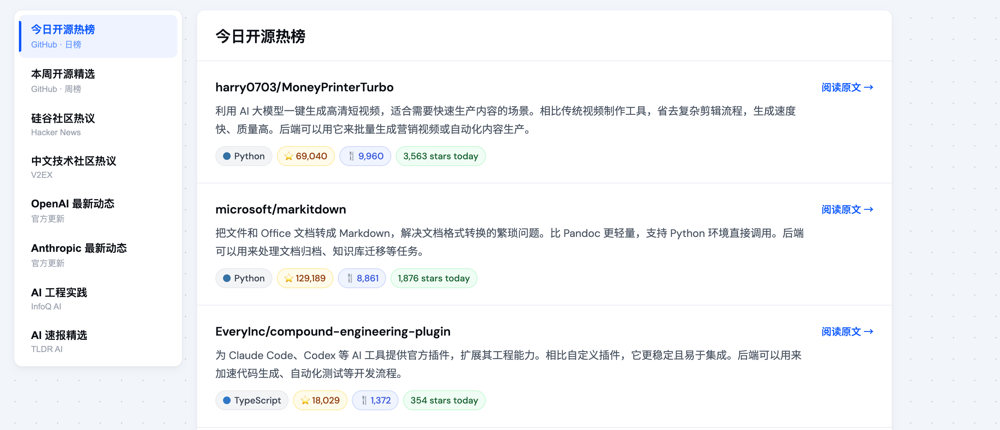
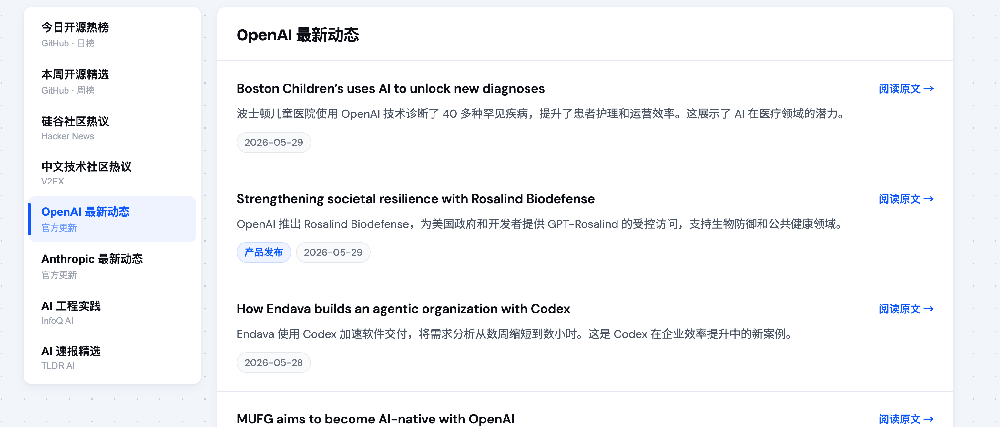

<h1 align="center">AI Daily Frontier</h1>

<p align="center">
  <em>多源 AI 信息聚合 · 每日自动采集 · 中文智能摘要</em>
</p>

<p align="center">
  
  
  
  
</p>

<p align="center">
  中文 | <a href="README_EN.md">English</a>
</p>

---

**AI Daily Frontier** 每日自动爬取 GitHub Trending、Hacker News、TLDR AI、OpenAI、Anthropic、InfoQ AI Development 等信息源，通过 GitHub Models API (GPT-4o) 生成中文摘要，提供 FastAPI 只读接口和 Vue 前端资讯流页面。

线上地址：**https://www.gdufe888.top/ai/**

## 截图

<p align="center">
  
</p>

<p align="center">
  
</p>

## 功能特性

- **6 大信息源** — GitHub Trending (日/周)、Hacker News、TLDR AI、OpenAI、Anthropic、InfoQ AI
- **AI 中文摘要** — GPT-4o 生成面向后端工程师的中文总结，关注工程落地
- **中英双语** — 前端支持 `?lang=en` / `?lang=zh` 切换，英文用户直接看原文摘要
- **统一 JSON** — 所有来源输出统一字段结构，`output/latest.json`
- **按来源归档** — 磁盘永久保留 + Redis 3 天热数据缓存
- **独立容错** — 任一源失败不影响其他源输出
- **内置定时采集** — FastAPI 进程内调度器，默认每天 3 次
- **每日 AI 播客** — 可选开启，凌晨自动生成前一天重点资讯音频摘要
- **Vue 前端** — 卡片式资讯流，骨架屏加载，响应式设计

## 快速开始

```bash
# 克隆 & 安装
git clone https://github.com/wenbochang888/github-trending-spider.git
cd github-trending-spider
pip3 install -r requirements.txt

# 配置（必须）
export GITHUB_TOKEN="ghp_your_token"  # GitHub Settings → Tokens → models:read

# 测试采集
python3 main.py

# 启动 API 服务
python3 -m uvicorn api:app --host 0.0.0.0 --port 8000

# 启动前端（开发）
cd frontend && npm install && npm run serve
```

## API

### JSON API

FastAPI 提供只读 JSON 接口，前端页面和外部系统都可以直接读取最新快照。

```bash
curl http://localhost:8000/api/health                         # 健康检查
curl http://localhost:8000/api/sources                        # 来源列表
curl http://localhost:8000/api/sources/github-daily/latest    # 单来源最新数据
curl http://localhost:8000/api/podcast/latest                 # 最新播客元数据
curl http://localhost:8000/api/podcast/dates/2026-07-18       # 指定日期播客元数据
```

线上 API base：

```text
https://www.gdufe888.top/api
```

常用线上接口：

```text
GET https://www.gdufe888.top/api/health
GET https://www.gdufe888.top/api/sources
GET https://www.gdufe888.top/api/sources/{source_id}/latest
GET https://www.gdufe888.top/api/podcast/latest
GET https://www.gdufe888.top/api/podcast/dates/{date}
GET https://www.gdufe888.top/api/podcasts/{date}/podcast.mp3
```

`source_id` 使用稳定来源 ID，例如：

```text
github-daily
github-weekly
hacker-news
v2ex
tldr-ai
openai
anthropic
infoq
```

<!-- Linux.do 技术日报上游停止更新，source_id `linux-do` 暂停开放，恢复时放回上方列表。 -->

### RSS

RSS 适合给阅读器、自动化工具或其他系统做通用订阅。当前提供一个总订阅源，聚合所有已注册来源的最新内容。

线上 RSS 地址：

```text
https://www.gdufe888.top/api/rss.xml
```

本地验证：

```bash
curl -i http://localhost:8000/api/rss.xml
```

线上验证：

```bash
curl -i https://www.gdufe888.top/api/rss.xml
```

RSS 接口只读取已有快照，不会触发实时爬虫；Redis 不可用时会沿用现有逻辑降级读取磁盘归档。更详细的字段说明和接入建议见 `docs/rss-api-guide.md`。

### Skill

仓库提供 `tech-trend-spider` Skill，用于让 AI 助手通过线上只读 API 查询本项目已经采集好的技术趋势数据。安装方不需要本仓库源码，也不需要 Python 爬虫依赖。

<p align="center">
  
</p>

Skill 文件：

```text
skills/tech-trend-spider/SKILL.md
```

默认 API base：

```text
https://www.gdufe888.top/api
```

适用场景：

- 查询 GitHub Trending 日榜或周榜。
- 查询 Hacker News、V2EX 等社区讨论。
<!-- Linux.do 技术日报上游停止更新，相关查询入口暂时停用。 -->
- 查询 TLDR AI、OpenAI、Anthropic、InfoQ AI 等 AI 资讯。
- 按关键词在 API 返回结果中做本地过滤。
- 按条数对 API 返回结果做本地截断。
- 按 Markdown 或 JSON 格式输出结果。

Skill 使用的接口仍然是上面的 JSON API，例如：

```text
GET https://www.gdufe888.top/api/sources
GET https://www.gdufe888.top/api/sources/{source_id}/latest
```

注意：Skill 只消费线上已采集快照，不直接爬源站，不重新生成 AI 摘要，也不控制调度、邮件、Redis 或部署。

## 技术架构

```
采集层: main.py → github_trending / hacker_news / tldr_ai / official_ai_sources
数据层: content_items.py → content_store.py → Redis + 磁盘归档
服务层: api.py (FastAPI) + scheduler.py (定时采集)
展示层: frontend/ (Vue 3) → Nginx 静态托管
```

## 配置

所有配置通过环境变量，均有合理默认值：

| 变量 | 默认值 | 说明 |
| --- | --- | --- |
| `GITHUB_TOKEN` | - | GitHub Models API token (必须) |
| `GITHUB_TRENDING_TOP_COUNT` | 10 | GitHub 各榜单取前 N 条 |
| `HN_TOP_COUNT` | 10 | HN 取前 N 条 |
| `TLDR_AI_TOP_COUNT` | 10 | TLDR AI 取前 N 条 |
| `REDIS_URL` | redis://localhost:6379/0 | Redis 连接地址 |
| `SPIDER_SCHEDULE_TIMES` | 07:50,15:50,23:50 | 每天采集时间 |
| `SEND_EMAIL_ENABLED` | false | 是否发送邮件 |
| `EMAIL_SEND_TIMES` | 07:50 | 未配置 `MAIL_TO_BY_TIME` 时，开启邮件后允许发送邮件的调度时间 |
| `MAIL_TO_BY_TIME` | - | 按调度时间指定不同收件人，JSON 对象格式 |
| `PODCAST_ENABLED` | false | 是否启用每日 AI 播客生成 |
| `PODCAST_SCHEDULE_TIME` | 02:30 | 每天生成播客的时间 |
| `PODCAST_TARGET_DATE_MODE` | yesterday | 生成前一天内容的播客 |
| `PODCAST_EXCLUDED_SOURCE_IDS` | tldr-ai,infoq | 播客生成时排除的来源 ID，逗号分隔 |
| `PODCAST_SCRIPT_MAX_RETRIES` | 5 | 播客脚本生成 API 临时失败时最大重试次数 |
| `PODCAST_SCRIPT_RETRY_SECONDS` | 5 | 播客脚本生成 API 重试基础间隔秒数，实际按次数递增 |
| `PODCAST_TTS_PROVIDER` | edge_tts | 第一版使用 edge-tts 合成语音 |
| `PODCAST_VOICE_MALE` | zh-CN-YunxiNeural | 男声 voice |
| `PODCAST_VOICE_FEMALE` | zh-CN-XiaoxiaoNeural | 女声 voice |
| `PODCAST_VOICE_MALE_RATE` | -4% | 男声语速，传给 edge-tts |
| `PODCAST_VOICE_FEMALE_RATE` | +0% | 女声语速，传给 edge-tts |
| `PODCAST_VOICE_MALE_PITCH` | -2Hz | 男声音调，传给 edge-tts |
| `PODCAST_VOICE_FEMALE_PITCH` | +0Hz | 女声音调，传给 edge-tts |
| `PODCAST_VOICE_MALE_VOLUME` | +0% | 男声音量，传给 edge-tts |
| `PODCAST_VOICE_FEMALE_VOLUME` | +0% | 女声音量，传给 edge-tts |
| `PODCAST_TURN_PAUSE_SECONDS` | 0.8 | 普通对话轮次之间的默认停顿秒数 |
| `PODCAST_TOPIC_PAUSE_SECONDS` | 1.1 | 同章节内话题转换的默认停顿秒数 |
| `PODCAST_CHAPTER_PAUSE_SECONDS` | 1.6 | 不同章节切换时的默认停顿秒数 |
| `PODCAST_TTS_MAX_RETRIES` | 3 | 单段 TTS 临时失败时最大重试次数 |
| `PODCAST_TTS_RETRY_SECONDS` | 3 | 单段 TTS 重试基础间隔秒数，实际按次数递增 |
| `PODCAST_MIN_DURATION_MINUTES` | 4 | 播客目标最短分钟数，低于该值会记录告警 |
| `PODCAST_MAX_DURATION_MINUTES` | 8 | 播客目标最长分钟数 |
| `PODCAST_MIN_TURN_COUNT` | 30 | 新生成脚本的最低有效对话轮数，不足会重试一次 |
| `PODCAST_MIN_SCRIPT_CHARS` | 1600 | 新生成脚本的最低台词字符数，不足会重试一次 |

每日播客还需要安装系统命令 `ffmpeg`，并在 Python 依赖中安装 `edge-tts`。脚本生成复用 `GITHUB_TOKEN` 调用 GitHub Models，不需要 `OPENAI_API_KEY`。
播客相关环境变量在后端进程启动时读取；修改 `PODCAST_ENABLED` 或其他播客配置后，需要重启后端服务才会生效。

> 完整配置项见源码 `config.py`

## 部署

```bash
# 后端启动（后台运行）
bash scripts/start_backend.sh

# 前端构建
cd frontend && npm run build

# 访问链路
# https://your-domain.com/ai/     → Nginx 托管 frontend/dist/
# https://your-domain.com/api/... → Nginx 反代 → FastAPI :8000
```

## 友情链接

<!-- Linux.do 日报来源暂停期间暂不展示相关入口；原链接：https://linux.do -->

## License

[MIT](LICENSE)
